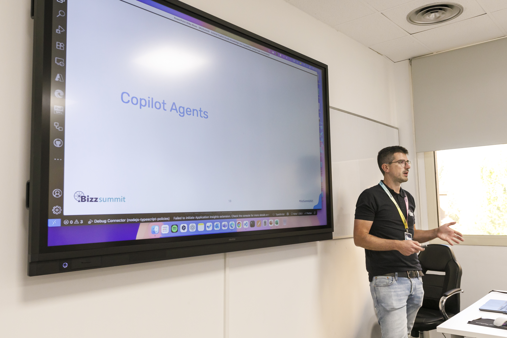

👋 My name is Angelo Gulisano and I am a Microsoft MVP for Business Apps, an MCT and a Speaker.

I’m Angelo Gulisano, a Microsoft MVP for Business Applications, MCT, and independent consultant with 18+ years of enterprise experience. I specialize in Power Platform, SharePoint, Microsoft 365, and full‑stack development, helping organizations worldwide accelerate digital transformation. With a background in .NET, Node, SQL Server and cloud technologies, I design and deliver end‑to‑end solutions that drive measurable business value. I’m passionate about technology, music, and travel, and I enjoy sharing knowledge through speaking engagements, courses, and blog posts.

Previously, I worked as a software developer with skills in Asp.net, SQL Server, .net Framework, and especially SharePoint, a platform that I am very passionate about and have been working with since 2007.

The experience and skills I have gained over the years allow me to provide consultancy and create customized solutions to meet the needs of my clients.

I am a curious person and passionate about problem-solving. I enjoy challenging myself with new tasks and finding creative solutions to overcome obstacles in my professional journey.

My blog: https://angelogulisano.com

👀 I’m interested in tech speech ,technology,travel, music and trading.

My linktr profile: https://linktr.ee/angelogulisano

## Most viewed blog posts

* [Power Apps – ChatGPT Integration](https://angelogulisano.com/blog/power-apps-chatgpt-integration/)
* [Power Automate - Restore deleted flows](https://angelogulisano.com/blog/power-automate-restore-deleted-flows/)
* [Power Automate - SharePoint get items filter](https://angelogulisano.com/blog/power-automate-sharepoint-get-items-filter/)
* [Power Apps - Creator Kit – Introduction](https://angelogulisano.com/blog/creator-kit-introduction/)
* [Power Apps - Improve performance](https://angelogulisano.com/blog/power-apps-improve-performance/)
* [SharePoint - JSON Custom form formatting](https://angelogulisano.com/blog/spo-json-form-custom-formatting/)
* [Power Apps - PDF Function](https://angelogulisano.com/blog/power-apps-pdf-function/)
